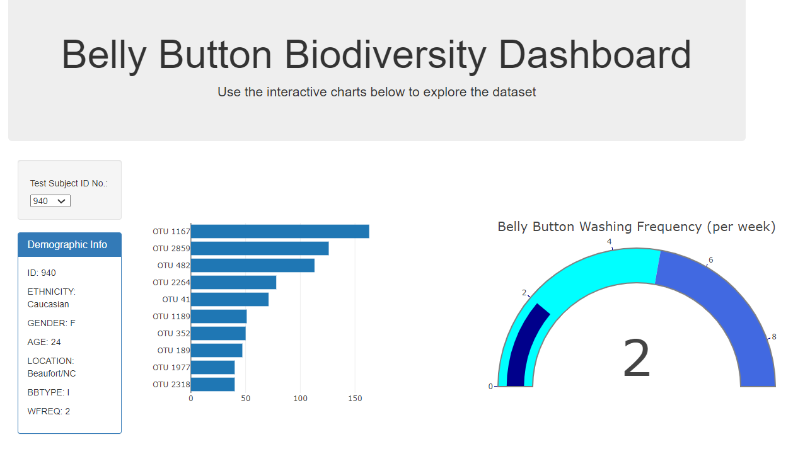

# Interactive Dashboard on Bacteria Found in Test Subjects

## Overview
This project visualizes data from a JSON file that reports types of bacteria found in the umbilici (non-scientific name: belly buttons) of a variety of test subjects. The dashboard allows users to explore the demographic information, bateria types, and washing frequency associated with each subject in the study.

---
### See the project here
https://millerbrook.github.io/Interactive_Dashboard_on_Bacteria_Found_in_Test_Subjects/
---
## Steps

### Step 1
Read data from the JSON file using D3 and munge it into usable forms.

Sample code: 
```
//Read samples.json
  d3.json("samples.json").then((data) => {
    var samples = data.samples; //create value to capture whole samples object from data
    //return appropriate sample object from within samples
    function filterSample_Values(samples) {
      return samples.id === SID; //Remember that samples.id must be a string
    }
    var sample = samples.filter(filterSample_Values);
    console.log(sample[0]);

    //Filter functions to get all sample_values, otu_ids, otu_labels for UID (940)
    var sample_values = sample.map((samp) => samp.sample_values)[0];
    var otu_ids = sample.map((samp) => samp.otu_ids)[0];
    var otu_labels = sample.map((samp) => samp.otu_labels)[0];

    //Slice functions to get Top 10 for sample_values, otu_ids, otu_labels for UID (940)
    var tenSampleValues = sample_values
      .sort(function compareFunction(firstNum, secondNum) {
        return secondNum - firstNum;
      })
      .slice(0, 10)
      .reverse();
    //Find index values of ten Sample Values, use to select otu_ids and labels
    data_indexes = [];
    for (let i = 0; i < tenSampleValues.length; i++) {
      for (let j = 0; j < sample_values.length; j++) {
        if (
          sample_values[j] === tenSampleValues[i] &&
          !data_indexes.includes(j)
        ) {
          data_indexes.push(j); //j is the index value of the appropriate sample_values to use to select otu_ids and otu_labels
        }
      }
    }

    //Now, make arrays of otu_ids and otu_labels based on the data_indexes (so all three arrays line up)
    ten_otu_ids = [];
    ten_otu_labels = [];
    data_indexes.forEach(function (data_index) {
      ten_otu_ids.push(`OTU ${otu_ids[data_index]}`);
      ten_otu_labels.push(otu_labels[data_index]);
    });
```
### Step 2
Create event listener to select data for display from the test subject dropdown menu.

Sample code:
```
function initDashboard() {
  //Select dropdown
  var dropdown = d3.select("#selDataset");
  //Select Demographic data box
  var demoInfo = d3.select("#sample-metadata");
  //Read samples.json
  d3.json("samples.json").then((data) => {
    //grab array of names for dropdown
    var names = data.names;
    names.forEach((UID) => {
      //Create dropdown options by appending each name to text and property attributes of new option
      dropdown.append("option").text(UID).property("value", UID);
      //console.log(typeof(UID))
    });
    //Set UID to first value to build initial plots and table
    var SID = "940";
    //call function to build initial charts and table
    buildChartsTable(SID);
  });
}

```
### Step 3
Build vizualizations and associated elements.


### Step 4
Deploy to Github Pages: https://millerbrook.github.io/interactive-viz-dash-challenge/

## Contact Information

Brook Miller

[Email](millerbrook@gmail.com)

[LinkedIn](www.linkedin.com/in/brook-miller-data)
